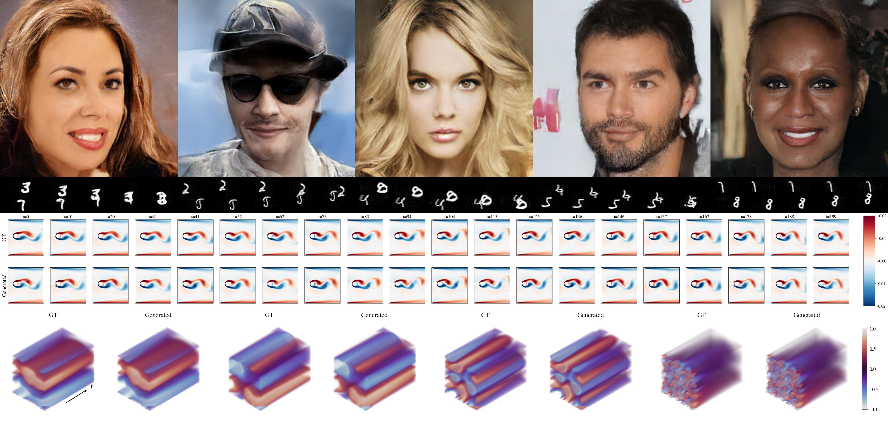

# DiffATS — Diffusion in an Aligned Tucker/SVD Basis



DiffATS trains a diffusion model in a low-rank basis whose orientation is
*aligned across samples* by per-sample Procrustes rotation against a fixed
reference anchor. The same recipe is applied to high-resolution images
(CelebA-HQ 1024x1024 via patch-SVD) and to spatio-temporal physics fields
(1D/2D PDEs and Moving MNIST videos via Tucker decomposition).

The repository contains:

- `exps/` — our method, ablations, and end-to-end pipelines for every dataset.
- `baselines/` — reference baselines we compare against (Average-Pooling
  diffusion, DCTdiff, FNO, SDIFT).
- `assets/` — figures used in this README.

---

## Method overview

For every sample $x$ we extract a low-rank factorization
$x \approx \alpha \, V^{\top}$, where the columns of $V$ span a per-sample
basis and $\alpha$ are the coefficients in that basis. Two operations make
the basis comparable across samples and tractable for a diffusion model:

1. **Per-sample factorization.** Patch-SVD for images
   ($x \in \mathbb{R}^{C\times P^2 \times r}$ patches, rank $r$) and Tucker /
   HOOI for spatio-temporal tensors (rank $[r_T, r_H, r_W]$). The IC frame is
   handled by a separate rank-$r_{ic}$ SVD when present.
2. **Procrustes alignment to a reference anchor.** A reference sample's
   factorization $V_{\text{ref}}$ is fixed, and every other sample's $V$ is
   rotated by $Q^\star = \arg\min_{Q\in O(r)} \|VQ - V_{\text{ref}}\|_F$,
   propagating the rotation into $\alpha$. This removes the rotational
   ambiguity of the low-rank decomposition and yields a globally consistent
   coordinate system on $(\alpha, V)$.

A diffusion model is then trained jointly on the aligned $(\alpha, V)$ pair
(`JointDiT` for images, a DiT variant for physics fields). At sample time we
denoise $(\alpha, V)$ and reconstruct $\hat{x} = \alpha\, V^{\top} + \mu_{\text{ref}}$.

---

## Repository layout

```
DiffATS/
├── README.md
├── assets/                                 # figures for this README
├── exps/                                   # our method
│   ├── celeba_hq/                          # high-resolution image generation
│   │   ├── methods/
│   │   │   ├── our_method/                 # patch-SVD + Procrustes + JointDiT
│   │   │   ├── no_alignment/               # ablation: same SVD, no Procrustes
│   │   │   ├── shared_bases/               # ablation: single global PCA basis
│   │   │   ├── data_augmentation/          # ablation: random SO(r) augment
│   │   │   └── sample_core.py              # unified sampler driver
│   │   ├── ablation/                       # SVD rank / patch-size sweeps
│   │   ├── diffusion/                      # diffusion training utilities (DDPM/DDIM)
│   │   ├── metrics/                        # FID / IS / precision-recall jobs
│   │   └── tools/                          # data download, watcher scripts
│   ├── tensor_physics/                     # 2D physics (Tucker)
│   │   ├── exp_burgers_2d/                 # 2D Burgers (ux, uy on 128x128, 200 steps)
│   │   │   ├── data_generation/            # APEBench Burgers driver + viz
│   │   │   ├── data_tucker/                # save_tucker_burgers + IC-SVD
│   │   │   ├── train/                      # DiT training on Tucker factors
│   │   │   ├── generate/                   # sampling + per-epoch jobs
│   │   │   └── configs/
│   │   ├── exp_karman_vortex/              # Karman vortex shedding
│   │   │   ├── data_generation/
│   │   │   ├── data_tucker/                # Tucker HOOI on vorticity clips
│   │   │   ├── train/
│   │   │   ├── generate/
│   │   │   └── configs/
│   │   └── tools/                          # shared evaluation: rmse, metrics, recon
│   ├── 1d_physics/                         # 1D PDEs (Tucker over T x X)
│   │   ├── 1d_burgers/                     # Burgers, periodic, 1024 x 201
│   │   └── 1d_reaction_diffusion/          # reaction-diffusion
│   └── moving_mnist/                       # video Tucker (15 clips x 64x64 x 20 frames)
│       ├── data_generation/                # slow-motion Moving MNIST generator
│       ├── data_tucker/                    # save Tucker factors
│       ├── diffusion/                      # diffusion utilities
│       ├── models/                         # CP-DiT / shared blocks
│       └── exp_15x64x20/                   # train / sample / FVD
└── baselines/                              # baselines we compare against
    ├── AveragePooling_Diffusion_Baseline/  # average-pool latent + diffusion
    ├── DCTdiff/                            # DCT-domain diffusion (ICML 2025)
    ├── FNO/                                # supervised FNO regressors
    └── SDIFT/                              # GP-noise diffusion + MPDPS (NeurIPS 2025)
```

---

## Datasets

| Domain | Tensor shape | Factorization | Used in |
|---|---|---|---|
| CelebA-HQ 1024 | $3\times 1024^2$ | patch-SVD, $P{=}32$, $r{=}32$ | `exps/celeba_hq` |
| 1D Burgers | $201\times 1024$ | Tucker $[r_T, r_X]$ | `exps/1d_physics/1d_burgers` |
| 1D Reaction-Diffusion | $201\times 1024$ | Tucker $[r_T, r_X]$ | `exps/1d_physics/1d_reaction_diffusion` |
| 2D Burgers (ux, uy) | $200\times 128\times 128$ + IC | Tucker $[r_T, r_H, r_W]$, IC-SVD $r_{ic}$ | `exps/tensor_physics/exp_burgers_2d` |
| 2D Karman vortex | $T\times X\times Y$ vorticity | Tucker $[r_T, r_X, r_Y]$ | `exps/tensor_physics/exp_karman_vortex` |
| Moving MNIST (slow) | $20\times 64\times 64$ | Tucker $[r_T, r_H, r_W]$ | `exps/moving_mnist` |

Data generation scripts (APEBench-based, JAX/Tensorly) live under each
`data_generation/` subfolder. Tucker-factor extraction (HOOI plus reference-anchor
Procrustes alignment) lives under `data_tucker/`.

---

## End-to-end pipeline

Every experiment follows the same five stages. File names below use the
`exp_burgers_2d` convention; other experiments are named analogously.

1. **Generate raw data** —
   `data_generation/generate_data.py` (+ `*_test.py` and SLURM submitters).
   Output: `*.pt` shards of raw fields plus PDE parameters.
2. **Extract aligned low-rank factors** —
   `data_tucker/save_tucker_burgers.py`. Picks one reference sample with
   `seed=42`, runs Tucker / SVD on every sample, then Procrustes-aligns
   factors to the reference anchor. Output: shards of
   $(U_1, U_2, U_3, C, U_{ic}, V_{ic}^{\top}, \text{params})$.
3. **Compute statistics for normalization** — for CelebA-HQ:
   `compute_alpha_stats_refimg.py` and `compute_vhat_stats_refimg.py`. The
   Tucker pipelines normalize per-channel inside `dataset_*.py`.
4. **Train the diffusion model** —
   `train/train_burgers_2d.py` driven by `configs/train_v1.yaml`. Models:
   - CelebA-HQ: `JointDiT` over $(\alpha, V)$ with width 768, depth 12.
   - Physics: dataset-specific DiT in `train/model_*_dit.py`.
5. **Sample and evaluate** —
   `generate/gen_burgers_2d.py` produces aligned-factor samples; the shared
   utilities under `exps/tensor_physics/tools/` (or the experiment's
   `metrics_*.py`) compute reconstruction RMSE and reference-vs-generated
   spectra. CelebA-HQ samples go through `methods/sample_core.py` and
   `metrics/compute_metrics.py` (FID / IS / precision-recall).

---

## Method variants on CelebA-HQ (`exps/celeba_hq/methods`)

| Variant | Key script | Description |
|---|---|---|
| `our_method` | `all_save_procrustes_svd_refimg_acceleration.py` | Patch-SVD then Procrustes alignment to a fixed reference image. JointDiT denoises $(\alpha, \hat V)$ jointly. |
| `no_alignment` | `all_save_no_alignment.py` | Patch-SVD with the natural SVD orientation; no Procrustes. Same JointDiT denoiser. |
| `shared_bases` | `all_save_global_pca.py` | One global PCA basis $D$ shared across the dataset; only $\alpha$ is diffused. |
| `data_augmentation` | shares the no-alignment preprocessor | Random $Q\in SO(r)$ data augmentation in place of Procrustes alignment (applied online during training). |

Each method directory exposes the same job templates: `job_preprocess.sh`,
`job_stats.sh`, `job_train_smoke.sh`, `job_train_full.sh`, `job_sample.sh`.

---

## Baselines (`baselines/`)

- **`AveragePooling_Diffusion_Baseline/`** — DiT diffusion in the latent space
  defined by $k\times k$ average pooling (no SVD/Tucker). One subdir per
  dataset (`Burgers_1D`, `Burgers_2D`, `Karman_Vortex_2D`, `Reaction_1D`,
  `Moving_MNIST_2D`, `CelebA_HQ`), each with `train.py`, `sample.py`,
  `eval.py`, and `*_DiT_Model.py`.
- **`DCTdiff/`** — Upstream code for *DCTdiff: Intriguing Properties of Image
  Generative Modeling in the DCT Space* (ICML 2025), with our PDE configs
  added (`configs/burgers{1d,2d}_*.py`, `configs/karman2d_*.py`,
  `configs/reaction1d_*.py`, `configs/moving_mnist_3d.py`). DCT statistics are
  precomputed by `compute_*_stats.py` and `precompute_*_dct.py`.
- **`FNO/`** — Supervised Fourier Neural Operator regressors. One
  `train_<dataset>.py` and `eval_<dataset>.py` per dataset.
- **`SDIFT/`** — Upstream code for *Generating Full-field Evolution of
  Physical Dynamics from Irregular Sparse Observations* (NeurIPS 2025).
  Files of interest: `FTM_model.py`, `train_FTM_*.py`, `train_GPSD_*.py`,
  `eval_*.py`, plus our adaptations for the four physics datasets and CelebA.

Each baseline has its own README (DCTdiff, SDIFT) or self-contained scripts
and is intended to be runnable independently of the `exps/` pipelines.

---

## Conventions and shared utilities

- **Diffusion utilities** under `exps/celeba_hq/diffusion/` and
  `exps/moving_mnist/diffusion/` are forks of the OpenAI / DiT diffusion
  module: `gaussian_diffusion.py`, `respace.py`, `timestep_sampler.py`,
  `diffusion_utils.py`. Both DDPM and DDIM samplers are exposed via
  `create_diffusion`.
- **Training entry points** are uniformly named `train.py` (CelebA-HQ) or
  `train_<dataset>.py` (physics) and read a YAML config under `configs/` /
  `train.yaml`.
- **Job scripts** (`job_*.sh`) are SLURM submitters for the Anvil/DeltaAI
  clusters; they hard-code account, partition, and absolute data paths and
  must be edited before use.
- **Shared evaluation** for the 2D physics experiments lives under
  `exps/tensor_physics/tools/`: `metrics_gen.py`, `metrics_raw.py`,
  `rmse_gen.py`, `rmse_raw.py`, `gt_norms.py`, `reconstruct_gen.py`,
  `eval_tucker_recon.py`, `make_lr_sweep_report.py`.

---

## Reproducing the headline figure

The cover figure (`assets/celeba_row.png`) shows CelebA-HQ 1024x1024 samples
drawn by `our_method` after 1000 training epochs. The exact rendering script
is `factor_diffusion/paper_images/_render_celeba_diffats.py` (kept outside
this repository because it pulls intermediate artifacts).

---

## Citation and credits

Baselines are unmodified upstream code where possible. Please cite the
original works when using their code paths:

- *DCTdiff* — Ning et al., ICML 2025.
- *SDIFT (FTM + GPSD + MPDPS)* — Chen et al., NeurIPS 2025.
- *DiT* — Peebles & Xie, ICCV 2023, used as the diffusion backbone.

The Procrustes / Tucker pipeline, the JointDiT denoiser, and all training,
preprocessing, and evaluation code under `exps/` are part of this work.
